# Чистовые слайды v3.9 — Проценты, пропорции, масштаб

> ## Блок 1. Пропорция: закон абсолютного баланса

### Слайд 0. Титульный — Проценты, пропорции, масштаб

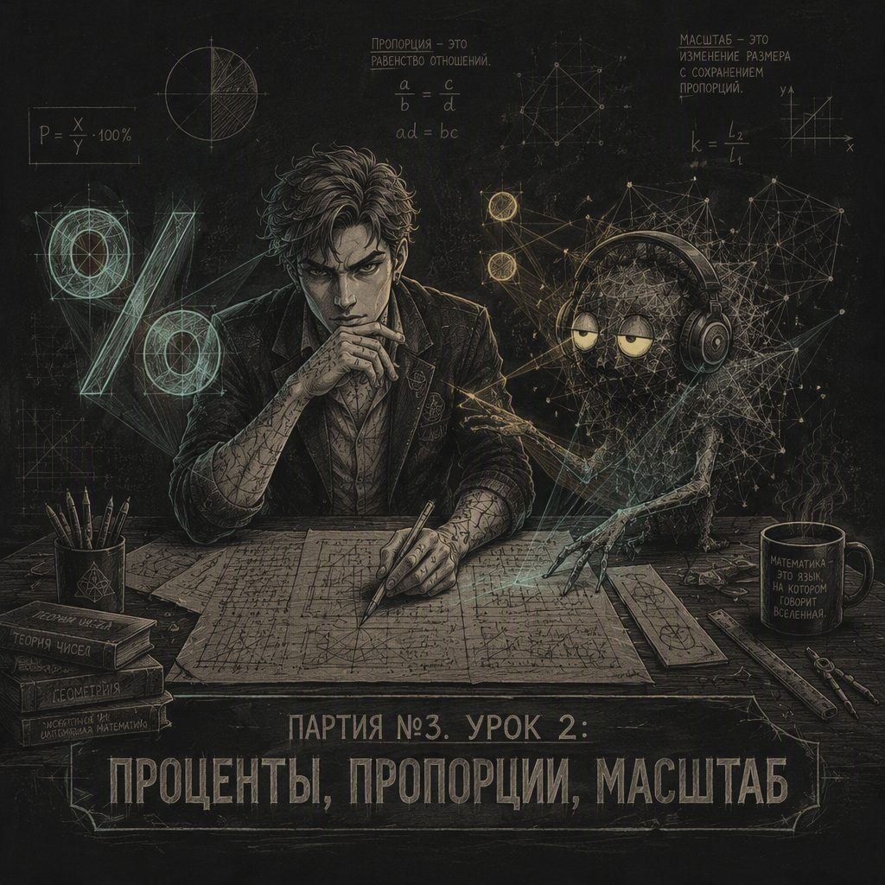

# Проценты, пропорции, масштаб

### Урок для ученика с абсолютного нуля

**Что тебя ждёт внутри:**

- 8 блоков теории
- 7 мостиков между блоками
- 10 экзаменационных задач в финальной самопроверке
- Шпаргалки, которые можно распечатать и взять на экзамен

**Зачем тебе этот урок:** задачи с процентами, пропорциями и масштабом стабильно дают 6–8 баллов из 100 на ЦТ. Это самые «лёгкие» деньги, если теорию знаешь.

---

*Первый содержательный слайд — Слайд 1 «Пропорция: равенство двух отношений».*

### Слайд 1. Пропорция: равенство двух отношений

**Почему это важно?** Пропорция — это главный инструмент для решения задач на проценты, масштабы, зависимости, и вообще любых задач, где две величины жёстко связаны друг с другом. Без понимания пропорции ты не сможешь решить ни одну задачу, где нужно найти неизвестную часть. Это атомарная база.

**Пропорция** — это равенство двух дробей: \(\frac{a}{b} = \frac{c}{d}\). Числа по краям (\(a\) и \(d\)) называются **крайними членами**, числа внутри (\(b\) и \(c\)) — **средними членами**.

**Основное свойство пропорции (закон крест-накрест):** в любой верной пропорции \(\frac{a}{b} = \frac{c}{d}\) линии креста идут наискосок (в математике эти линии называют диагоналями). Закон абсолютного баланса говорит: если перемножить числа наискосок по одной линии, результат будет строго равен произведению чисел наискосок по другой линии:

\[a \cdot d = b \cdot c\]

Знак равенства посередине означает, что эти две линии полностью уравновешивают друг друга.

Пример. Равны ли дроби \(\frac{2}{3}\) и \(\frac{4}{6}\)? Проверяем наискосок: \(2 \cdot 6 = 12\) и \(3 \cdot 4 = 12\). \(12 = 12\) ✓ — дроби равны.

> Лайфхак:
>
> Закон работает в обе стороны. Если у тебя есть равенство двух дробей, ты можешь превратить его в равенство произведений наискосок. Если у тебя есть равенство произведений наискосок — ты можешь превратить его в две дроби через знак «равно». Это называется «основное свойство пропорции».

### Слайд 2. Как решать задачу через пропорцию

**Алгоритм «3 шага»:**

**Шаг 1. Построй пропорцию.** Выпиши известные величины и поставь неизвестную букву в нужное место.

**Шаг 2. Примени закон крест-накрест:** перемножь числа наискосок и запиши их равенство в одну строчку.

**Шаг 3. Вырази неизвестное.** Числитель дели на знаменатель.

Пример. Выразите \(x\) из \(\frac{x}{7} = \frac{12}{3}\).

Решение: перемножаем крест-накрест: \(x \cdot 3 = 12 \cdot 7\). Делим обе части на 3: \(x = \frac{12 \cdot 7}{3} = 4 \cdot 7 = 28\).

**Ответ:** \(x = 28\).

> ️ Практический приём:
>
> Если неизвестное стоит в числителе одной из дробей, удобно сразу избавиться от знаменателя: умножь обе части пропорции на этот знаменатель. Например: \(\frac{x}{7} = \frac{12}{3} \Rightarrow x = \frac{12 \cdot 7}{3} = 28\). Так ты сразу получаешь ответ без крестовины.

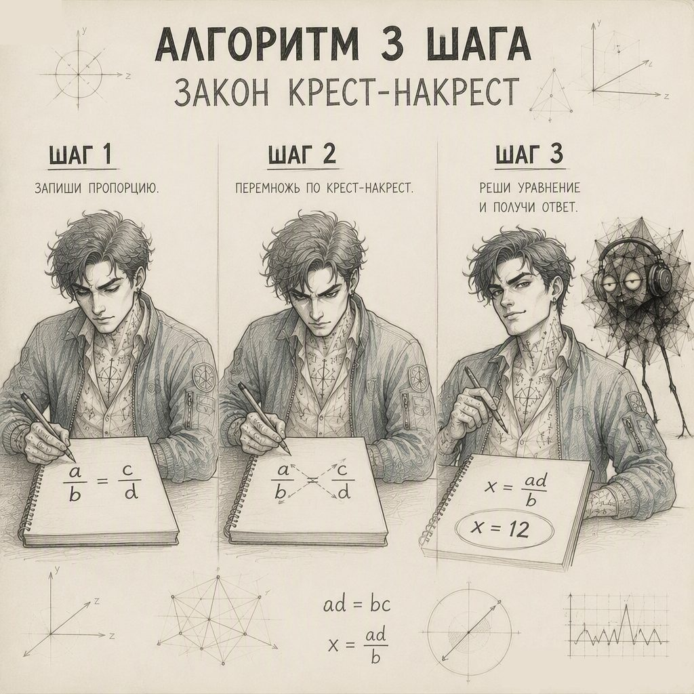

**Как думать при новой задаче на пропорцию:**

Когда видишь «найди неизвестное» или «равны ли дроби», не гадай. Иди по плану:

1. **Выпиши все известные величины** в две строки или две колонки. Что известно? Что ищем?
2. **Построй пропорцию** — поставь букву \(x\) в нужное место. Если прямая зависимость — большему соответствует большее.
3. **Примени закон крест-накрест:** \(x = \frac{\text{произведение известных по одной диагонали}}{\text{известное число по другой диагонали}}\).
4. **Проверь здравый смысл**: ответ должен быть больше или меньше ожидаемого по логике задачи.

### Слайд 3. Свойство пропорции: произведение крест-накрест

**Основное свойство пропорции:** в верной пропорции \(\frac{a}{b} = \frac{c}{d}\) произведение крайних членов равно произведению средних членов: \(a \cdot d = b \cdot c\). Это и есть закон крест-накрест: числа наискосок друг к другу дают одинаковое произведение.

Это свойство позволяет:
- проверять, верна ли пропорция (перемножить крест-накрест);
- находить неизвестный член пропорции (выразить через остальные три).

> ️ Жёсткое ограничение:
>
> Свойство работает только когда все члены пропорции — числа или выражения, которые можно перемножить. Если в знаменателе окажется 0, свойство не работает (делить на ноль запрещено).

## Мостик 1. От пропорции к зависимостям

> **Твой первый кирпич урока готов.**
>
> Пропорция — это фундамент, на котором стоит весь урок. Ты научился видеть равенство двух дробей, проверять его наискосок, и доставать из неё неизвестное число через закон крест-накрест.
>
> **Что ты теперь умеешь:** записывать пропорцию из условия, проверять её наискосок, находить неизвестный член через закон крест-накрест.
>
> Следующий блок покажет, как применять пропорцию в задачах с зависимостями. Это задачи, где две величины двигаются вместе (или наоборот — одна растёт, другая падает). Пропорция остаётся твоим главным инструментом.

## Блок 2. Зависимости: прямая и обратная

### Слайд 4. Прямая зависимость: синхронный рост

**Почему это важно?** В задачах часто две величины двигаются вместе: больше товара — больше денег, больше рабочих — больше объём работы. Это прямая зависимость. Если ты её распознаёшь, задача становится простой пропорцией.

**Прямая зависимость «синхронный рост и падение»:** две величины двигаются в одну сторону. Если первая растёт — вторая тоже растёт. Если первая падает — вторая тоже падает. Во сколько раз больше взял одну — во столько же раз больше получишь другую.

Пример. Цена шоколадки заморожена. Больше шоколадок (больше) → больше денег за покупку (больше). Если цена одной шоколадки 2 рубля, то за 3 шоколадки заплатишь \(3 \cdot 2 = 6\) рублей, а за 6 шоколадок — \(6 \cdot 2 = 12\) рублей.

**Способ через пропорцию:** \(\frac{\text{товар}_1}{\text{деньги}_1} = \frac{\text{товар}_2}{\text{деньги}_2}\).

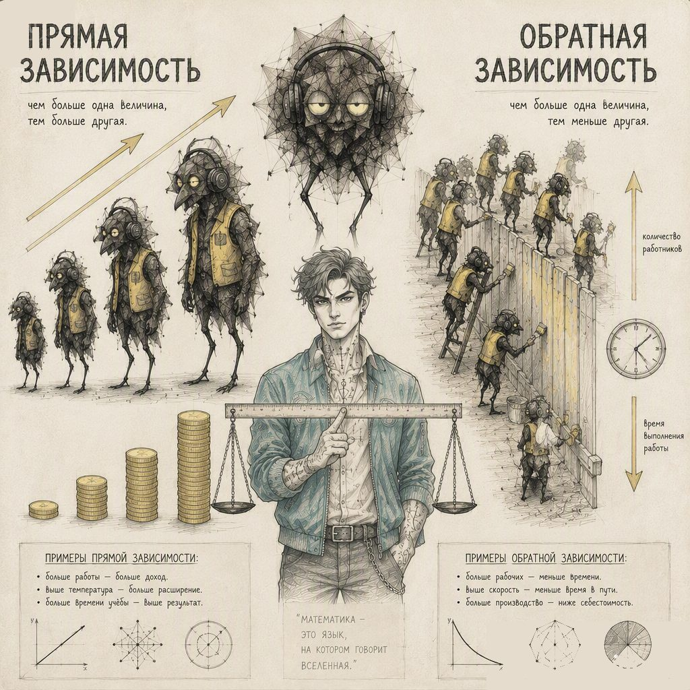

### Слайд 5. Обратная зависимость: противофаза

**Обратная зависимость «больше → меньше»:** одна величина растёт, другая падает. Во сколько раз больше сил — во столько раз меньше времени.

Обратная зависимость — это та же пропорция, но с перевёрнутой колонкой. Запишем данные строго друг под другом:

\[
\begin{array}{cc}
\text{3 рабочих} & \text{12 дней} \\
\text{9 рабочих} & x \text{ дней}
\end{array}
\]

**Шаг перехода от таблицы к дроби (показываем явно):**

1. Берём **колонку дней** (12, x) — это колонка обратной величины (дни уменьшаются при увеличении людей). Переворачиваем её вверх ногами → получаем (x, 12).
2. Берём **колонку рабочих** (3, 9) — оставляем как есть → (3, 9).
3. Собираем дробь: первую колонку делим на вторую.

\[ \frac{\text{рабочие}}{\text{дни (перевёрнутые)}} = \frac{3}{9} \quad \text{и} \quad \frac{x}{12} \]

Итого:

\[ \frac{3}{9} = \frac{x}{12} \]

и перемножаем наискосок по закону крест-накрест:

\[3 \cdot 12 = 9 \cdot x \Rightarrow 36 = 9x \Rightarrow x = 4 \text{ дня.}\]

> **Правило:** в обратной зависимости мы переворачиваем ту колонку, которая соответствует обратной величине. Если дни уменьшаются при увеличении людей — переворачиваем колонку дней. Если скорость растёт при уменьшении времени — переворачиваем колонку времени.

Пример. Расстояние до дома заморожено. Выше скорость (больше) → меньше времени на дорогу (меньше). Если ехать 60 км/ч, до дома 60 км, время = 1 час. Если ехать 120 км/ч (в 2 раза быстрее), время = 0,5 часа (в 2 раза меньше).

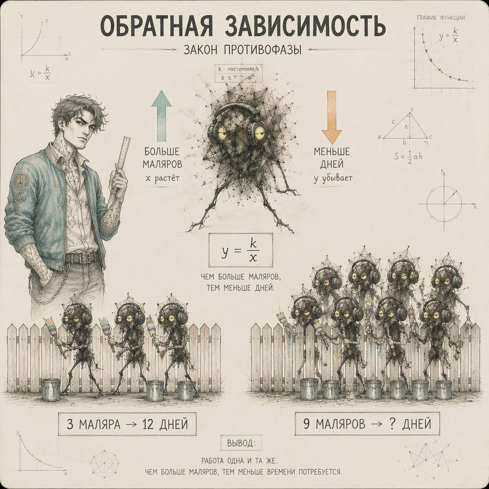

> Возможная ловушка:
>
> Составители рассчитывают, что ты перепутаешь прямую и обратную связь и получишь 36 дней вместо 4. 9 человек не могут строить стену в 3 раза дольше, чем 3 человека. Если ответ противоречит здравому смыслу — ты попал в ловушку.

### Слайд 5.1. Скрипт самопроверки Блока 2

Прежде чем записать ответ, задай черновику три жёстких вопроса (Правило Трёх Попыток):

**Попытка 1 — тип зависимости.** Проверь: больше одной величины — значит и вторая больше (прямая), или меньше (обратная)? Если сомневаешься — нарисуй стрелки: «больше \(\Rightarrow\) меньше» или «больше \(\Rightarrow\) больше».

**Попытка 2 — подстановка в условие.** Если 9 рабочих строят стену за 4 дня, то \(9 \cdot 4 = 36\) человеко-дней. А 3 рабочих за 12 дней — \(3 \cdot 12 = 36\) человеко-дней. Совпало ✓. Если не совпало — ошибка в арифметике.

**Попытка 3 — здравый смысл.** Имеет ли ответ физический смысл? 9 рабочих за 36 дней — это 324 человеко-дня, а 3 рабочих за 12 дней — это 36 человеко-дней. Разница в 9 раз. Так не бывает. Если здравый смысл нарушен — перечитай условие и перепроверь тип зависимости.

## Мостик 2. От зависимостей к масштабу

> Ты освоил прямую и обратную зависимость через пропорцию.
>
> **Паспорт темы «Зависимости»:** прямая «больше → больше», обратная «больше → меньше», метод перевёрнутой пропорции для обратной. Эти три кита остаются с тобой до конца урока.
>
> Следующий блок — про географические задачи. Когда на бумаге нужно показать огромное расстояние в километрах, чертёж уменьшают в определённое число раз. Это называется масштаб.

## Блок 3. Масштаб: уменьшение реальности на бумаге

### Слайд 6. Масштаб: отношение чертежа к реальности

**Почему это важно?** На картах и чертежах мы уменьшаем реальные расстояния в тысячи и миллионы раз, чтобы они поместились на лист бумаги. Знание масштаба позволяет по размеру на бумаге вычислить реальное расстояние, и наоборот.

**Масштаб** — это отношение размера на чертеже к реальному размеру:

\[ \text{Масштаб} = \frac{\text{размер на чертеже}}{\text{реальный размер}} \]

Масштаб всегда записывается как \(1 : X\), где \(X\) — во сколько раз реальный размер больше размера на бумаге. Например, \(1 : 100\) означает, что **1 единица на бумаге = \(X\) единиц в реальности** (то есть 1 см на бумаге = 100 см в реальности, или 1 метр).

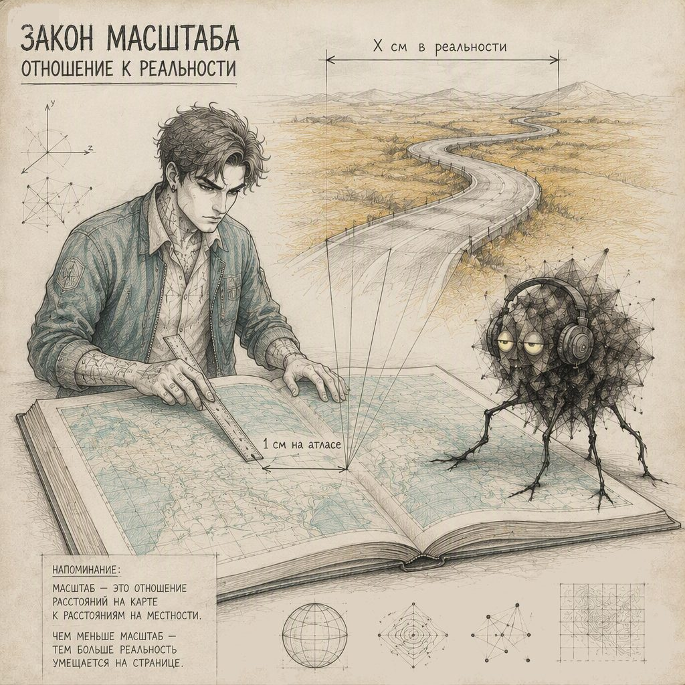

### Слайд 7. Перевод единиц: метрический мост

Главная трудность — чертеж и реальность даны в разных единицах: миллиметры на бумаге, километры в реальности. Чтобы составить пропорцию, нужно привести всё к одной единице. Самый безопасный выбор — **миллиметры**.

**Почему при переходе от километров к миллиметрам добавляется именно 6 нулей?** Разложим этот перевод по шагам:
- В 1 километре содержится ровно 1000 метров (это первые 3 нуля).
- В каждом метре содержится ровно 1000 миллиметров (это ещё 3 нуля).
- Итог: \(3 + 3 = 6\) нулей. Это двойной перевод единиц измерения на черновике.

**Таблица перевода в миллиметры:**
- Километры (км) \(\to\) миллиметры: \(\times 1\,000\,000\) (6 нулей)
- Метры (м) \(\to\) миллиметры: \(\times 1\,000\) (3 нуля)
- Сантиметры (см) \(\to\) миллиметры: \(\times 10\) (1 ноль)

**Обратный перевод (из миллиметров):**
- Сантиметры: \(\div 10\) (1 ноль)
- Метры: \(\div 1\,000\) (3 нуля)
- Километры: \(\div 1\,000\,000\) (6 нулей)

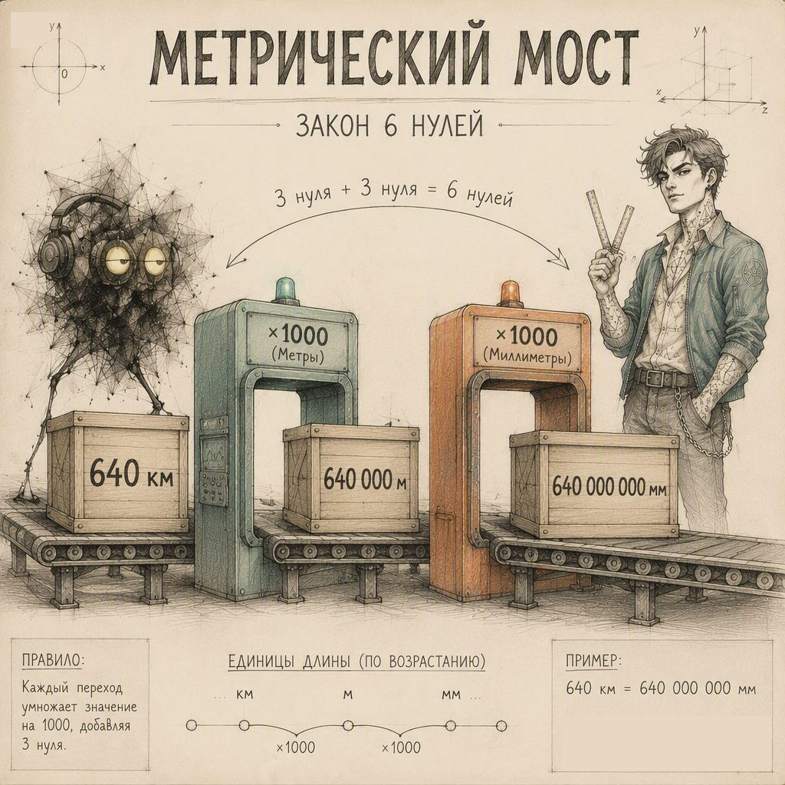

Пример. Реальное расстояние 640 км, на чертеже 16 мм. Переводим км в мм: \(640 \cdot 1\,000\,000 = 640\,000\,000\) мм. Составляем пропорцию: \(\frac{16}{640\,000\,000}\). Сокращаем на 16: \(\frac{1}{40\,000\,000}\).

**Масштаб:** \(1 : 40\,000\,000\).

> Лайфхак:
>
> Когда видишь огромное число с нулями, не паникуй. Закрой пальцем все нули в знаменателе и сократи «живые» цифры. В нашем примере живые цифры — 16 наверху и 64 внизу. \(64 \div 16 = 4\). Возвращай нули на место — к четвёрке допиши 7 нулей (один от 640 и шесть от перевода).

### Слайд 7.1. Скрипт самопроверки Блока 3

**Вопрос 1.** Все ли единицы приведены к одному виду перед составлением пропорции? Если на чертеже мм, а в задаче км — нужно перевести.

**Вопрос 2.** Масштаб получился в виде \(\frac{1}{X}\)? Если получилось наоборот (\(\frac{X}{1}\)) — переверни дробь.

**Как думать при новой задаче на масштаб:**

1. **Запиши обе величины с указанием единиц** (что на бумаге, что в реальности).
2. **Переведи в одну единицу** (миллиметры — самый безопасный выбор).
3. **Составь пропорцию** \(\frac{\text{чертеж}}{\text{реальность}}\).
4. **Сократи дробь** до вида \(\frac{1}{X}\). Если нужна реальная длина — умножь число на бумаге на \(X\).

## Мостик 3. От масштаба к процентам

> Ты освоил пропоцию через задачи на зависимости и масштаб.
>
> **Паспорт темы «Масштаб»:** отношение 1:X (1 единица на бумаге = X единиц в реальности), перевод км↔м↔мм через 6 нулей (двойной перевод единиц), метод сокращения «живых цифр» через деление числителя и знаменателя на общий множитель. Эти три инструмента остаются с тобой до конца урока.
>
> В следующем блоке разберём три главные ловушки процентов. Если ты их увидишь — они тебя не поймают.
>
> Следующий блок — про проценты. Процент — это специальная запись дроби, у которой знаменатель всегда 100. Любая процентная задача сводится к пропорции.

## Блок 4. Проценты: сотые части целого

### Слайд 8. Что такое процент: сотая часть целого

**Почему это важно?** Слово «процент» встречается в каждой второй жизненной ситуации: скидки в магазине, налоги, банковские ставки, статистика, экзаменационные баллы. Без понимания процента ты не сможешь ни считать сдачу, ни понимать новости, ни решать задачи на ЦТ.

**Процент (символ \(\%\))** — это просто одна сотая часть \(\frac{1}{100}\) от какого-то целого числа. Чтобы это было легко представить, используй аналогию с наполненным стаканом воды:
- Полный стакан — это твоё целое, и мы официально принимаем его за \(100\%\).
- Половина стакана — это \(50\%\).
- Пустой стакан — это \(0\%\).
- Два полных стакана — это \(200\%\).

Один процент (\(1\%\)) — это ровно одна сотая часть (одна капля) от объёма этого стакана. Знаменатель такой дроби всегда равен 100, а числитель говорит, сколько процентов сейчас налито.

**Процент (символ \(\%\))** — это сотая часть числа. Запись «\(p\%\)» означает «\(p\) сотых частей числа», то есть дробь \(\frac{p}{100}\).

Пример. \(1\%\) — это \(\frac{1}{100}\) числа, то есть одна сотая часть. У числа 200 это \(200 \cdot \frac{1}{100} = 2\). У числа 50 это \(50 \cdot \frac{1}{100} = 0{,}5\).

**Связь с десятичными дробями:** \(p\% = \frac{p}{100}\). Например, \(25\% = \frac{25}{100} = 0{,}25\), \(50\% = \frac{50}{100} = 0{,}5\), \(100\% = 1\), \(200\% = 2\).

**Связь с обыкновенными дробями:** \(p\% = \frac{p}{100}\) — это уже готовая дробь со знаменателем 100. Её можно сократить: \(25\% = \frac{25}{100} = \frac{1}{4}\), \(50\% = \frac{1}{2}\), \(75\% = \frac{3}{4}\).

**Главное свойство:** целое число принимается за \(100\%\). Это значит, что когда мы говорим «найти \(p\%\) от числа \(A\)», мы находим \(\frac{p}{100}\) от \(A\), то есть \(A \cdot \frac{p}{100}\).

### Слайд 9. Три формулы процента

Все процентные задачи строятся на трёх формулах. Каждая отвечает на свой вопрос.

**Формула 1 (часть от целого).** Ищем ЧАСТЬ, дано ЦЕЛОЕ и процент.

\[ \text{Часть} = A \cdot \frac{p}{100} \]

Где \(A\) — целое (\(100\%\)), \(p\) — процент.

**Жизненный сценарий:** магазин даёт скидку 15% на товар за 200 руб. Сколько стоит товар со скидкой?

**Решение:** \(\text{Часть} = 200 \cdot \frac{15}{100} = 30\) руб — это скидка. Цена со скидкой: \(200 - 30 = 170\) руб.

**Формула 2 (целое по части).** Ищем ЦЕЛОЕ, дано ЧАСТЬ и её процент от целого.

\[ A = \frac{B \cdot 100}{p}, \quad p \neq 0 \]

Где \(B\) — часть, \(p\) — её процент от целого.

**Жизненный сценарий:** налог 13% от зарплаты составил 1300 руб. Какова зарплата?

**Решение:** \(A = \frac{1300 \cdot 100}{13} = 10\,000\) руб.

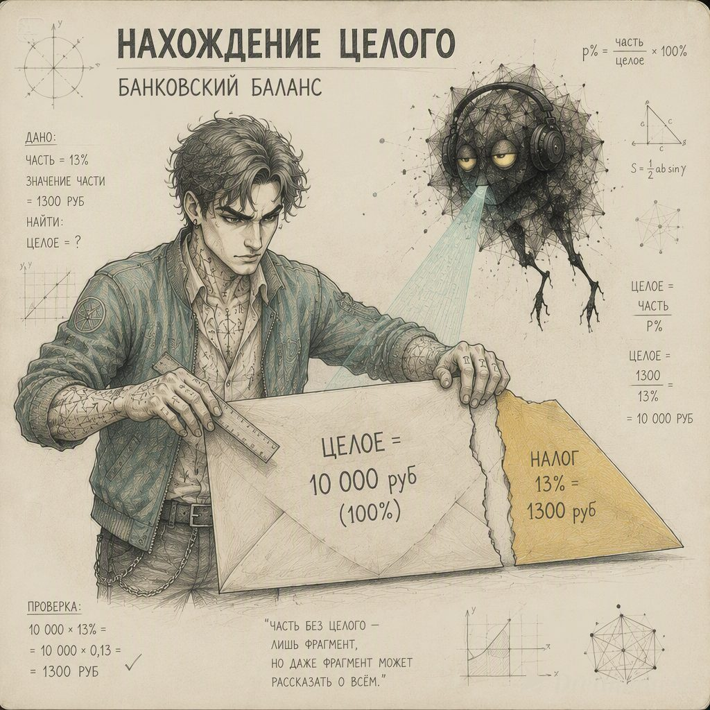

**Формула 3 (процент по части и целому).** Ищем ПРОЦЕНТ, дано ЧАСТЬ и ЦЕЛОЕ.

\[ p = \frac{B \cdot 100}{A}, \quad A \neq 0 \]

Где \(B\) — часть, \(A\) — целое.

**Жизненный сценарий:** в магазин привезли 200 яблок, из них 30 красных. Сколько процентов красных?

**Решение:** \(p = \frac{30 \cdot 100}{200} = 15\%\).

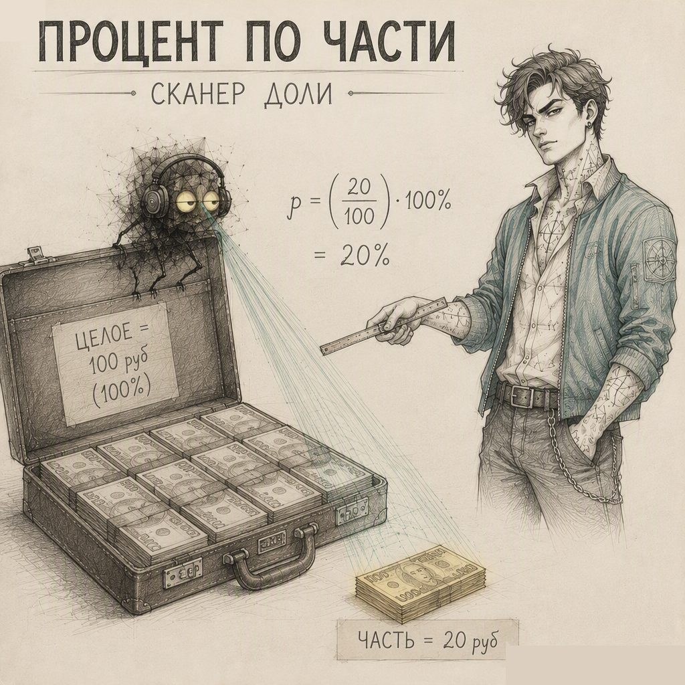

> Закон-триггер: три формулы процентов — это перестановка одной и той же пропорции. Если помнишь Формулу 1, остальные получаются из неё алгебраически (умножением или делением обеих частей).

### Слайд 9.5. Как распознать ЦЕЛОЕ и ЧАСТЬ в условии задачи

Прежде чем применять формулы — разберись, что в задаче ЦЕЛОЕ, а что ЧАСТЬ. Это ключ к правильному решению.

**В любой процентной задаче два главных персонажа:**

- **ЦЕЛОЕ** — это то, ЧЕГО мы считаем за 100%. Целое всегда известно в задаче про "найти процент от числа" (там задано число) И обычно дано в условии в виде конкретной суммы.
- **ЧАСТЬ** — это то, что мы ищем или что нам дано как процент от целого.

**Как распознать ЦЕЛОЕ по формулировкам в условии:**

| Формулировка в условии | ЦЕЛОЕ |
|---|---|
| «15% от 200» | 200 (это ЧИСЛО, от которого берём процент) |
| «30 — это 15% от какого-то числа» | ищем число (оно и есть целое) |
| «30 от 200 — это сколько процентов?» | 200 (это ЧИСЛО, относительно которого считаем процент) |
| «цена была 100, стала 120» | 100 (СТАРАЯ цена — это целое, относительно неё считаем изменение) |
| «в растворе 40 г соли, всего 500 г» | 500 (это ОБЩАЯ масса раствора — целое) |

**Три главных слова-подсказки:**

- **«от чего» / «от какого числа»** — целое стоит ПОСЛЕ этих слов.
- **«составляет X%»** — то, что составляет процент, это ЧАСТЬ. То, относительно чего — это ЦЕЛОЕ.
- **«было/стало»** — «было» = ЦЕЛОЕ, «стало» = новая часть (или новое целое, если изменилось).

> **Совет ученикам: не понимаешь что от тебя хотят — рисуй.**
>
> Если условие задачи звучит запутанно, не пытайся сразу подставлять числа в формулу. Возьми лист бумаги и:
> 1. **Нарисуй целое** (прямоугольник, круг, банку, отрезок).
> 2. **Отметь часть** (заштрихуй кусок).
> 3. **Подпиши известные числа** (что дано).
> 4. **Подпиши вопрос** (что ищем).
>
> После этого становится ясно, какую формулу применять. Часто после рисунка ответ очевиден.

**Как думать при новой задаче на процент:**

1. **Прочитай условие дважды.** Если не понял с первого раза — прочитай ещё раз.
2. **Определи, что дано** (целое? часть? процент? всё вместе?).
3. **Определи, что ищем** (часть? целое? процент?).
4. **Если сомневаешься — рисуй** (целое как фигуру, часть как заштрихованный кусок).
5. **Выбери формулу** (Формула 1/2/3).
6. **Подставь данные** и вычисли.
7. **Проверь здравый смысл:** \(p\%\) должен быть меньше \(100\%\) (если часть) или больше \(0\%\) (если целое).

## Мостик 4. От базовых формул к жизненным задачам

> Ты только что собрал главный рабочий инструмент урока — три формулы процента.
>
> **Главное открытие:** эти три формулы — не три разных правила. Это одна и та же пропорция, записанная тремя способами (перестановкой членов). Помнишь формулу 1 — остальные получатся из неё алгебраически.
>
> Следующий блок покажет, как применять эти формулы в трёх типовых жизненных сценариях: скидки, налоги и сложные проценты.

## Блок 5. Типы процентных задач

### Слайд 9.1. Закон перевёртыша: \(a\%\) от \(b\) = \(b\%\) от \(a\)

**Открытие.** Умножение — коммутативная операция: \(a \cdot b = b \cdot a\). Поэтому для процентов работает симметричный закон:

\[ a\% \text{ от } b = \frac{a}{100} \cdot b = \frac{b}{100} \cdot a = b\% \text{ от } a \]

**Пример.** Что больше: \(52\%\) от 20 или \(20\%\) от 52? Считаем:

- \(52\%\) от \(20\) = \(20 \cdot 0{,}52 = 10{,}4\).
- \(20\%\) от \(52\) = \(52 \cdot 0{,}20 = 10{,}4\).

Результат одинаковый: \(10{,}4\) в обоих случаях.

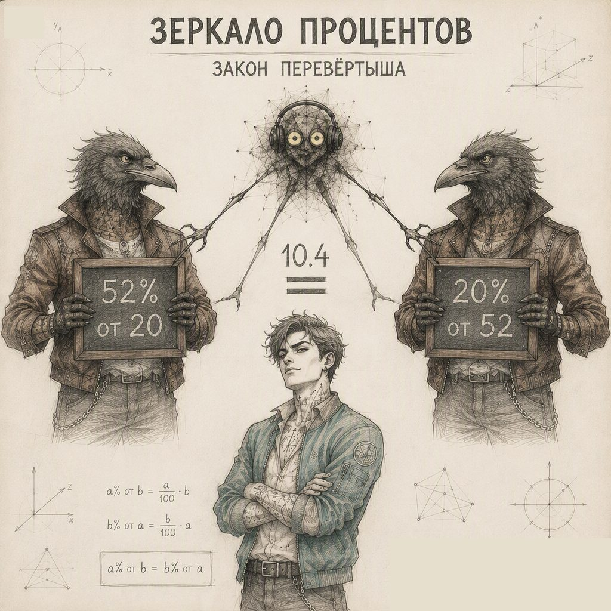

**Практический совет: ищи то, что удобнее считать.** Если в задаче нужно найти, например, \(15\%\) от \(200\), но это неудобно, можно поменять местами и считать \(200\%\) от \(15\) = \(15 \cdot 2 = 30\) — тот же ответ. Это трюк для устного счёта.

> Закон-триггер: в процентах работает коммутативность. Если задача «X% от Y» кажется сложной — попробуй «Y% от X». Может оказаться проще.

> **Совет ученикам.** Если дан большой процент от маленького числа (например, \(98\%\) от 5), попробуй перевернуть: \(5\%\) от 98 = \(98 \cdot 0{,}05 = 4{,}9\) — то же самое, но считать удобнее.

### Слайд 10. Тип 1: «Найти процент от числа» (скидка, налог, часть)

**Сценарий:** магазин даёт скидку \(p\%\) на товар стоимостью \(A\) рублей. Сколько стоит товар со скидкой?

**Алгоритм:**
1. Найди размер скидки: \(\text{Скидка} = A \cdot \frac{p}{100}\).
2. Вычти скидку из цены: \(\text{Цена со скидкой} = A - \text{Скидка} = A \cdot (1 - \frac{p}{100})\).

Пример. Шоколадка стоит 50 руб (за одну штуку), скидка \(20\%\). Скидка = \(50 \cdot 0{,}2 = 10\) руб. Цена со скидкой = \(50 - 10 = 40\) руб. Или сразу: \(50 \cdot 0{,}8 = 40\).

**️ Разбор «двойной скидки» пошагово:**

**Почему при последовательных скидках в \(20\%\) и \(10\%\) общая скидка равна \(28\%\), а не \(30\%\)?** Давай разберём шаги устно:

- Начальная цена товара — \(100\%\). После первой скидки в \(20\%\) цена упала до \(80\%\) от начальной.
- Вторая скидка в \(10\%\) берётся уже от этой новой, уменьшенной цены. Сколько составят \(10\%\) от \(80\%\)? Это \(8\%\).
- Значит, вторая скидка снижает цену ещё на \(8\%\) от первоначальной стоимости.
- Общее снижение цены: \(20\% + 8\% = 28\%\). Оставшаяся стоимость товара — \(72\%\) (или \(0{,}8 \cdot 0{,}9 = 0{,}72\)).

Товар стоил 50 руб. Сначала скидка \(20\%\), потом ещё скидка \(10\%\) от новой цены. Сколько стоит товар?

**Шаг 1.** Первая скидка: \(50 \cdot 0{,}8 = 40\) руб.
**Шаг 2.** Вторая скидка от НОВОЙ цены: \(40 \cdot 0{,}9 = 36\) руб.
**Итог:** 36 руб.

Реальная общая скидка: \(\frac{50 - 36}{50} = \frac{14}{50} = 28\%\), а не \(30\%\)!

> Возможная ловушка:
>
> Скидку \(20\%\) НЕЛЬЗЯ складывать с \(10\%\) и получать \(30\%\). Это ошибка «двойной скидки»: реальная скидка — это не сумма процентов, а умножение долей. Каждая скидка применяется к оставшейся цене, а не к начальной.

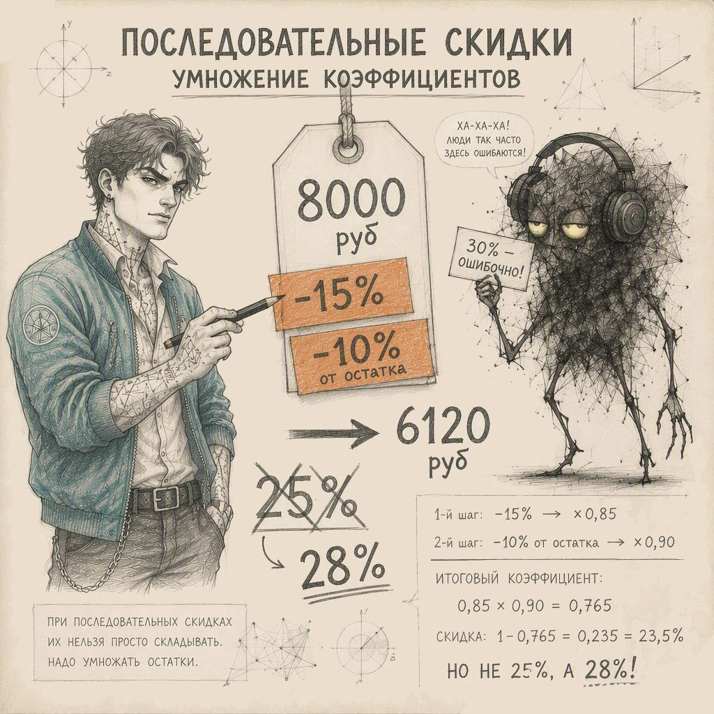

### Слайд 11. Тип 2: «Найти целое по его проценту» (налог, бюджет)

**Сценарий:** налог \(p\%\) от стоимости товара составил \(B\) рублей. Какова полная стоимость товара?

**Алгоритм:** \(A = \frac{B \cdot 100}{p}, \quad p \neq 0\).

Пример. Налог \(13\%\) от зарплаты составил 1300 руб. Зарплата = \(\frac{1300 \cdot 100}{13} = 10\,000\) руб.

> Лайфхак:
>
> Если процент маленький (например, \(5\%\)), удобно мыслить так: \(5\%\) — это \(\frac{1}{20}\). Значит, целое в 20 раз больше части.

### Слайд 12. Простой процент: фиксированная дань

**Простой процент** — это когда одна и та же процентная ставка применяется к одной и той же исходной сумме каждый период. Например, банк платит \(15\%\) годовых на начальный вклад \(5000\) руб и НЕ добавляет проценты к сумме.

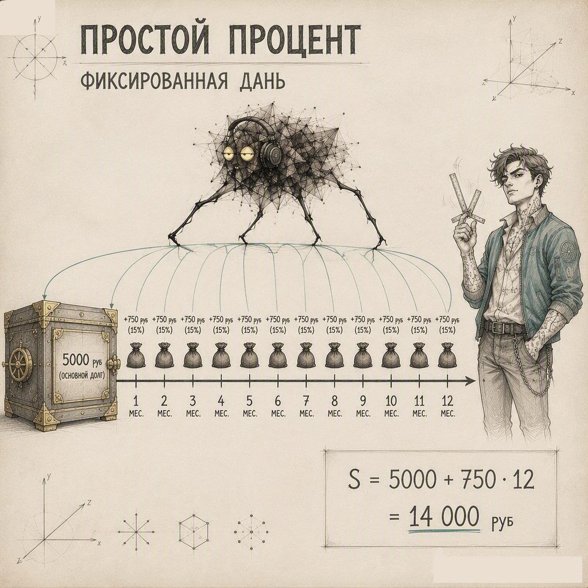

**Формула простого процента** (\(n\) периодов подряд):

\[ S = A + A \cdot \frac{p}{100} \cdot n = A \cdot \left(1 + \frac{p \cdot n}{100}\right), \quad A \neq 0 \]

**Переменные в формуле:**

| Буква | Что обозначает | Пример |
|---|---|---|
| \(A\) | начальная сумма (то, что лежит в банке в начале) | \(A = 5000\) руб |
| \(S\) | итоговая сумма (то, что получится в конце) | \(S = 14\,000\) руб |
| \(p\) | процент за один период (годовой банковский процент) | \(p = 15\) |
| \(n\) | число периодов (сколько месяцев/лет лежит) | \(n = 12\) |

**Пример.** Начальный вклад \(A = 5000\) руб под \(p = 15\%\) годовых, держим \(n = 12\) лет. Каждый год банк начисляет 15% на НАЧАЛЬНУЮ сумму (простой процент — проценты не прибавляются к сумме, а просто копятся отдельно):

\[ S = A + A \cdot \frac{p}{100} \cdot n = 5000 + 5000 \cdot 0{,}15 \cdot 12 = 5000 + 9000 = 14\,000 \text{ руб.} \]

**Проверка:** каждый год банк начисляет 750 руб (это 15% от 5000). За 12 лет это \(750 \cdot 12 = 9000\) руб процентов. Итого: \(5000 + 9000 = 14000\) руб.

> Закон-триггер: в простом проценте проценты **не складываются с суммой**. Каждый год ты получаешь одну и ту же фиксированную дань: 15% от НАЧАЛЬНОЙ суммы. За 12 лет это \(12 \cdot 750 = 9000\) руб процентов.

> ️ Возможная ловушка:
>
> > Простой процент часто путают с ростом зарплаты, инфляцией или банковской капитализацией. Там процент применяется к НОВОЙ сумме — это сложный процент (Слайд 14).

**Простой vs Сложный — в чём разница на одном примере:**

Положил в банк 1000 руб под 10% годовых, держим 3 года.

**Простой процент** (Слайд 12): каждый год +100 руб от НАЧАЛЬНОЙ суммы.

- Год 1: 1000 + 100 = 1100
- Год 2: 1100 + 100 = 1200
- Год 3: 1200 + 100 = 1300

**Сложный процент** (Слайд 14): каждый год +10% от ТЕКУЩЕЙ суммы.

- Год 1: 1000 × 1.1 = 1100
- Год 2: 1100 × 1.1 = 1210
- Год 3: 1210 × 1.1 = 1331

**Разница:** простой даёт 1300, сложной — 1331. На длинных сроках разница растёт: за 10 лет простой даст 2000, а сложной — 2594.

### Слайд 13. Тип 3: «Сколько процентов составляет часть» (доля, изменение)

**Сценарий из жизни.** В магазине «Пятёрочка» в июне было 240 покупателей в день, а в июле стало 288. На сколько процентов вырос поток покупателей?

**Алгоритм:**
1. Найди изменение: \(B - A = 288 - 240 = 48\) (на сколько выросло).
2. Раздели изменение на СТАРОЕ значение: \(\frac{48}{240} = 0{,}2\).
3. Умножь на 100: \(0{,}2 \cdot 100 = 20\%\).

**Формула:** \(p = \frac{(B - A) \cdot 100}{A}\), где \(A\) — старое значение (ЦЕЛОЕ = 100%), \(B\) — новое значение (ЧАСТЬ, которую ищем в процентах).

> Возможная ловушка:
>
> Процент изменения ВСЕГДА считается от СТАРОГО значения, а не от нового. Если цена упала с 100 до 80, изменение = \(-20\), процент = \(\frac{-20 \cdot 100}{100} = -20\%\) (снижение на \(20\%\)). Если ошибочно делить на новое (80), получишь \(-25\%\) — это математически неверно.

### Слайд 13.1. Скрипт самопроверки Блока 5

**Вопрос 1.** Ты правильно определил тип задачи (часть / целое / процент)? Если перепутал — формула не сработает.

**Вопрос 2.** Процент изменения считал от СТАРОГО значения, а не от нового?

### Слайд 13.2. Задачи на смеси и сплавы (растворы)

**Типичная задача.** В 500 г раствора соли содержится 40 г соли. Какова концентрация соли в процентах?

**Алгоритм «3 шага»:**

1. Найди часть: масса соли = 40 г.
2. Найди целое: масса раствора = 500 г.
3. Примени формулу процента по части: \(p = \frac{40 \cdot 100}{500} = 8\%\).

**Ответ:** \(8\%\).

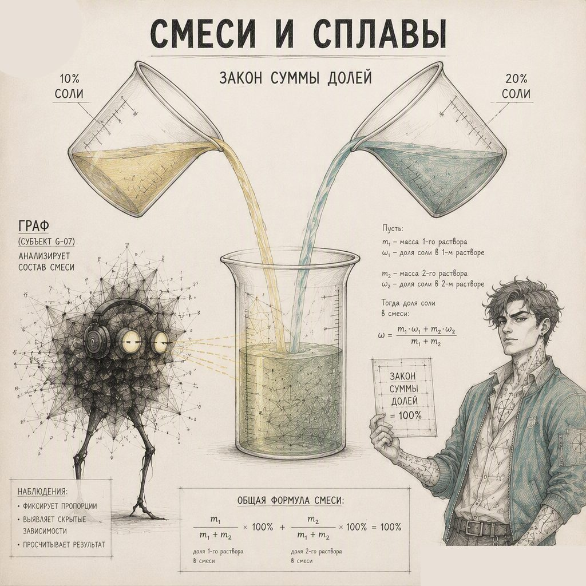

**Обратная задача на смешивание.** Смешали 200 г \(10\%\)-го раствора и 300 г \(20\%\)-го раствора. Какова концентрация нового раствора?

**Алгоритм:**
1. Найди массу соли в первом растворе: \(200 \cdot 0{,}1 = 20\) г.
2. Найди массу соли во втором растворе: \(300 \cdot 0{,}2 = 60\) г.
3. Общая масса соли: \(20 + 60 = 80\) г.
4. Общая масса раствора: \(200 + 300 = 500\) г.
5. Концентрация: \(\frac{80 \cdot 100}{500} = 16\%\).

**Ответ:** \(16\%\).

**Закон суммы долей:** абсолютно все компоненты, находящиеся внутри одного сосуда (соль, сахар, кислота, вода), в сумме всегда составляют ровно \(100\%\) от общей массы этого раствора. Если тебе известна доля одного вещества, доля всех остальных вычисляется простым вычитанием из полных \(100\%\).

> Возможная ловушка:
>
> Не путай «процент соли» с «процентом воды». В растворе соли \(8\%\) означает \(8\%\) массы — это соль. Остальные \(92\%\) — вода. Если в задаче спрашивают «процент воды», ответ будет \(92\%\), а не \(8\%\).

## Мостик 5. От простых процентов к сложным

> **Пауза для осознания. Ты собрал пять инструментов работы с процентами в одном уроке:** три типа задач (найти процент от числа, найти целое по части, найти долю), простой процент с фиксированной данью, закон суммы долей для смесей и сплавов.
>
> До этого момента ты решал задачи, где процент применяется **один раз** (скидка, налог, изменение цены один раз). Следующий блок — про ситуацию, когда процент применяется **много раз подряд**: банковский вклад с капитализацией, инфляция, ежегодное изменение цены. Это сложные проценты. Главное отличие: на втором шаге процент берётся уже от НОВОЙ суммы, а не от исходной.
>
> Готовься: будет формула со степенью. Но степень появится не как готовый результат, а как короткая запись цепочки из (n) одинаковых умножений.

## Блок 6. Сложные проценты: цепное применение

### Слайд 14. Что такое сложный процент

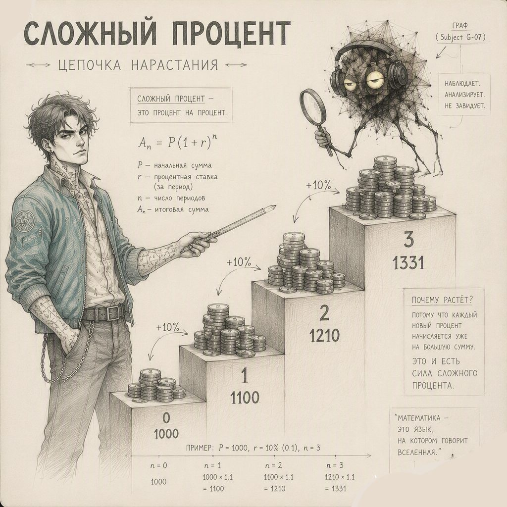

**Простой процент** — это когда процент применяется один раз к исходной сумме (см. Слайд 12).

**Сложный процент** — это когда процент применяется несколько раз, причём каждый раз к УЖЕ ИЗМЕНЁННОЙ сумме. После первого применения сумма меняется, и второй процент берётся от НОВОЙ суммы, а не от исходной.

**Откуда берётся множитель \(k\)?** Каждый год мы оставляем \(100\%\) старой суммы и добавляем \(p\%\) новых процентов. Итого за год получаем \((100 + p)\%\). Чтобы перевести проценты в десятичную дробь, делим на 100: \((100 + p)\% = \frac{100 + p}{100} = 1 + \frac{p}{100}\). Этот множитель обозначают буквой \(k\).

**Почему именно формула степени?** Каждый год сумма умножается на один и тот же множитель \(k = 1 + \frac{p}{100}\). Получается цепочка умножений: каждый следующий год — это предыдущий, умноженный на \(k\).

- Год 0: \(A\)
- Год 1: \(A \cdot k\)
- Год 2: \(A \cdot k \cdot k = A \cdot k^2\)
- Год 3: \(A \cdot k^3\)
- Год \(n\): \(A \cdot k^n\)

Каждое следующее умножение на \(k\) добавляет одну новую «ступеньку» в цепочке. Поэтому в формуле стоит именно \(k^n\), а не \(n \cdot k\) (как при простом проценте, когда умножение заменяется сложением одного и того же слагаемого).

**Мост от простого к сложному.** Сравни две формулы:

- Простой процент (Слайд 12): \(S = A \cdot \left(1 + \frac{p \cdot n}{100}\right)\) — один множитель, период стоит МНОЖИТЕЛЕМ.
- Сложный процент: \(S_n = A \cdot \left(1 + \frac{p}{100}\right)^n\) — период стоит в СТЕПЕНИ.

Чтобы из простого получить сложный, нужно период \(n\) «перенести в степень». Это превращает СЛОЖЕНИЕ (\(p + p + p + ...\) в простом) в УМНОЖЕНИЕ (\(k \cdot k \cdot k \cdot ...\) в сложном).

**Главный закон сложных процентов:** если каждый период применяется один и тот же процент \(p > -100\), то после \(n\) периодов:

\[ S_n = A \cdot \left(1 + \frac{p}{100}\right)^n, \quad p > -100 \]

**Переменные в формуле (запомни каждую букву):**

| Буква | Что обозначает | Пример из Слайда 15 |
|---|---|---|
| \(A\) | исходная сумма (то, что лежит в банке в начале) | \(A = 1000\) руб |
| \(S_n\) | итоговая сумма после \(n\) периодов (то, что получится в конце) | \(S_3 = 1331\) руб |
| \(p\) | процент за один период (например, годовой банковский процент) | \(p = 10\) |
| \(n\) | число периодов (сколько раз применяется процент) | \(n = 3\) (года) |
| \(k\) | множитель роста за один период: \(k = 1 + \frac{p}{100}\) | \(k = 1{,}1\) |

> Возможная ловушка:
>
> В формуле \(\left(1 + \frac{p}{100}\right)^n\) скобки возводятся в степень \(n\). Если \(p = 10\%\) и \(n = 3\), нужно посчитать \((1{,}1)^3 = 1{,}331\), а не \(1 + 1{,}1^3 = 1 + 1{,}331 = 2{,}331\). Скобки имеют приоритет.

### Слайд 15. Задача на сложный процент

**Условие.** В банк положили 1000 руб под \(10\%\) годовых. Сколько денег будет на счёте через 3 года (проценты начисляются каждый год и добавляются к сумме)?

**Интуиция «почему степень».** Каждый год происходит одно и то же: берём текущую сумму и умножаем на \(k = 1{,}1\). Через 3 года это умножение применяется 3 раза подряд. Три одинаковых умножения подряд — это и есть \(k^3\). Если бы процент применялся 5 лет — было бы \(k^5\), если 10 лет — \(k^{10}\).

**Решение по шагам:**

**Год 1:** \(1000 \cdot 1{,}1 = 1100\).

**Год 2:** \(1100 \cdot 1{,}1 = 1210\).

**Год 3:** \(1210 \cdot 1{,}1 = 1331\).

**По формуле (одно действие вместо трёх):** \(S_3 = 1000 \cdot (1{,}1)^3 = 1000 \cdot 1{,}331 = 1331\).

**Ответ:** 1331 руб.

> Лайфхак:
>
> Если в задаче не сказано «сложный процент» или «капитализация», считай простой процент. Сложный процент — это инвестиции, вклады, инфляция. Простой — скидки, налоги, премии.

### Слайд 15.1. Скрипт самопроверки Блока 6

**Вопрос 1.** В условии явно сказано «сложный процент», «капитализация», «каждый год добавляется к сумме»? Если нет — считай простой.

**Вопрос 2.** Правильно ли возвёл \((1 + \frac{p}{100})\) в степень \(n\)? Если \(n = 3\) и \(p = 10\), должно быть \((1{,}1)^3 = 1{,}331\).

**Как думать при новой задаче на сложный процент:**

1. **Найди ключевые слова:** «каждый год», «капитализация», «с учётом процентов прошлых», «через \(n\) лет под \(p\%\) годовых».
2. **Подставь в формулу:** \(S_n = A \cdot (1 + \frac{p}{100})^n\).
3. **Вычисли** по шагам (если \(n \leq 3\)) или используй калькулятор для степени.
4. **Проверь:** итог должен быть больше исходного (при положительном проценте).

## Мостик 6. От сложных процентов к архиву формул

> Поздравляю: ты прошёл все методы работы с процентами, пропорциями и масштабом.
>
> **Инвентаризация перед архивом:** у тебя в голове теперь живут 4 крупных инструмента — пропорция с законом наискосок, прямая и обратная зависимость, три формулы процента, формула сложного процента со степенью. Каждый из них решает свой класс задач.
>
> Следующий блок — Сборник формул. Его можно распечатать и держать под рукой на экзамене, чтобы быстро вспомнить, какую формулу к какой задаче применять.

## Блок 7. Сборник формул

### Слайд 16. Шпаргалка пропорции

\[ \frac{a}{b} = \frac{c}{d} \iff a \cdot d = b \cdot c \]

**Пример:** \(\frac{2}{3} = \frac{4}{6}\), проверка: \(2 \cdot 6 = 12 = 3 \cdot 4\).

### Слайд 17. Шпаргалка зависимостей

**Прямая зависимость «больше → больше»:** больше параметр \(A\) \(\to\) больше параметр \(B\). Решение через пропорцию: \(\frac{A_1}{B_1} = \frac{A_2}{B_2}\).

**Пример:** 3 шоколадки по 2 руб = 6 руб, 6 шоколадок по 2 руб = 12 руб.

**Обратная зависимость «больше → меньше»:** больше параметр \(A\) \(\to\) меньше параметр \(B\). Решение через строчки: \(A_1 \cdot B_1 = A_2 \cdot B_2\).

**Пример:** 3 рабочих \(\cdot\) 12 дней = 9 рабочих \(\cdot\) \(x\) дней \(\Rightarrow x = 4\).

### Слайд 18. Шпаргалка процентов

> **Откуда берётся формула `A = B × 100 / p`?** Если часть \(B\) — это \(\frac{p}{100}\) от целого \(A\), то можно записать: \(B = \frac{p}{100} \cdot A\). Чтобы выразить \(A\), делим обе части на \(\frac{p}{100}\):
>
> \[ A = \frac{B}{\frac{p}{100}} = B \cdot \frac{100}{p} = \frac{B \cdot 100}{p} \]
>
> Это и есть Формула 2. Запомни её не как готовый факт, а как **вывод из Формулы 1**. Все три формулы процентов — одна пропорция, записанная тремя способами.

| Тип задачи | Формула | Пример |
| --- | --- | --- |
| Часть от целого | `Часть = A × p / 100` | 15% от 200 = 30 |
| Целое по части | `A = B × 100 / p` | 30 это 15% → A = 200 |
| Процент по части | `p = B × 100 / A` | 30 от 200 = 15% |
| Изменение в % | `p = (B − A) × 100 / A` | Цена 100 → 120 = +20% |

### Слайд 19. Шпаргалка масштаба

\[ \text{Масштаб} = \frac{\text{размер на бумаге}}{\text{реальный размер}} = \frac{1}{X} \]

**Пример:** реальное 640 км, на бумаге 16 мм. Перевод: \(640 \cdot 1\,000\,000 = 640\,000\,000\) мм. Масштаб = \(\frac{16}{640\,000\,000} = \frac{1}{40\,000\,000}\).

### Слайд 20. Шпаргалка сложных процентов

\[ S_n = A \cdot \left(1 + \frac{p}{100}\right)^n \]

**Пример:** 1000 руб под \(10\%\) на 3 года: \(S_3 = 1000 \cdot 1{,}1^3 = 1000 \cdot 1{,}331 = 1331\) руб.

### Слайд 21. Зачем тебе всё это: мотивация перед экзаменом

Проценты, пропорции и масштабы — это не школьная формальность, а реальный рабочий инструмент.

Когда ты поймёшь, как они устроены, ты сможешь:
- Считать скидки в магазине без калькулятора.
- Понять условия банковского вклада.
- Разобраться в новостях про инфляцию.
- Решать задачи ЦТ, не путаясь в формулировках.

Математика становится лёгкой не когда зазубришь формулы, а когда научишься их собирать из пропорции. Это твой главный инструмент.

**Ты прошёл все 7 блоков теории.** Ты умеешь решать задачи, которые путают больше половины выпускников. На ЦТ это даст тебе уверенность в задачах с процентами, пропорциями и масштабом — они стоят в части А и Б экзамена. **Один тип задач освоен — минус одна зона стресса на экзамене.**

## Мостик 7. Передышка перед ловушками

> Ты прошёл всю теорию урока. Дальше — десять задач на реальных формулировках из экзаменационных сборников. Это не новый материал — это проверка того, что ты уже умеешь.
>
> **Если что-то забыл** — вернись к шпаргалкам в Слайдах 16–21 (пропорция, зависимости, проценты, масштаб, сложный процент). Там всё собрано в одной формуле.
>
> **Если в задаче не получается с первого раза** — это нормально. Прочитай условие дважды, нарисуй целое как фигуру, отметь часть. Потом выбирай формулу.

## Блок 8. Возможные ловушки из реальных задач

Эти задачи собраны из тестовых сборников и реальных экзаменов. Каждая ловушка — это формулировка, которая звучит просто, но прячет конкретное действие.

### Слайд 21.5. Шпаргалка по типам задач в Блоке 8

| Тип задачи | Какая формула | Слайд-шпаргалка |
|---|---|---|
| Последовательные скидки | умножение коэффициентов \(0{,}85 \cdot 0{,}9\) | Слайд 10, 16 |
| Рост/падение населения | умножение коэффициентов \(1{,}04 \cdot 1{,}06\) | Слайд 10, 14 |
| Смеси и сплавы | сумма масс чистого вещества / сумма масс растворов | Слайд 13.2, 19 |
| Масштаб карты | перевод см↔км (5 нулей в одном направлении, 5 — в другом) | Слайд 6, 7, 19 |
| Прямая/обратная зависимость | пропорция (для прямой) или произведение в строчку (для обратной) | Слайд 4, 5, 17 |
| Изменение цены в % | (новая − старая) / старая × 100 | Слайд 13, 19 |
| Банковский вклад с капитализацией | формула сложного процента \(S_n = A \cdot (1+p/100)^n\) | Слайд 14, 20 |
| Пропорциональные размеры (участки) | равенство отношений сторон | Слайд 1, 16 |
| Переливание жидкости | баланс объёмов после переливания | Слайд 4, 5, 9 |
| Квартиры в двух домах | средневзвешенное двух процентов | Слайд 9, 9.5 |

**Как пользоваться шпаргалкой:** прочитай условие задачи, найди в таблице похожий тип, открой соответствующий слайд-шпаргалку, примени формулу.

### Слайд 22. Задача на сложную скидку в два этапа

**Условие.** Товар стоил 8000 руб. Магазин сначала снизил цену на \(15\%\), потом ещё на \(10\%\) от новой цены. Какова итоговая цена?

**Что прячется в формулировке:** две последовательные скидки — это не \(15 + 10 = 25\%\), а умножение коэффициентов.

**Решение по шагам:**
1. После первой скидки: \(8000 \cdot 0{,}85 = 6800\) руб.
2. После второй скидки: \(6800 \cdot 0{,}9 = 6120\) руб.

**Итоговая цена:** 6120 руб.

**Проверка через формулу сложного процента:** \(8000 \cdot 0{,}85 \cdot 0{,}9 = 8000 \cdot 0{,}765 = 6120\) ✓.

**Проверка здравым смыслом:** цена упала, итог меньше начального (6120 < 8000 ✓). Скидка реальная 28%, а не 25% — это сходится.

> ️ Возможная ловушка: ученик складывает проценты скидок (\(15 + 10 = 25\%\)) и получает \(8000 \cdot 0{,}75 = 6000\) — неверно. Скидки применяются последовательно, не суммируются.

### Слайд 22.1. Задача на сложный процент (рост населения)

**Условие.** Население города составляло 50000 человек. За первый год оно выросло на \(4\%\), за второй — ещё на \(6\%\). Каким стало население?

**Что прячется:** два последовательных процентных изменения — это умножение коэффициентов, а не сложение процентов.

**Решение:**
1. После первого года: \(50000 \cdot 1{,}04 = 52000\).
2. После второго года: \(52000 \cdot 1{,}06 = 55120\).

**Ответ:** 55120 человек.

**Проверка здравым смыслом:** население выросло (55120 > 50000 ✓). Реальный рост \(10{,}24\%\), что больше чем «\(4+6=10\%\)» — это сходится (умножение даёт больше чем сложение).

> ️ Возможная ловушка: ученик считает «общий процент» как \(4 + 6 = 10\%\) и получает \(55000\) — неверно. Реальный рост: \(1{,}04 \cdot 1{,}06 = 1{,}1024\), то есть \(10{,}24\%\), а не \(10\%\).

### Слайд 22.2. Задача на смешивание растворов (разные концентрации)

**Условие.** Имеется 300 г \(15\%\)-го раствора соли и 500 г \(25\%\)-го раствора. Их смешали. Какова концентрация нового раствора?

**Что прячется:** концентрация смеси — это сумма масс чистого вещества, делённая на сумму масс растворов. Здесь работает закон суммы долей (Слайд 13.2).

**Решение:**
1. Соль в первом растворе: \(300 \cdot 0{,}15 = 45\) г.
2. Соль во втором растворе: \(500 \cdot 0{,}25 = 125\) г.
3. Общая соль: \(45 + 125 = 170\) г.
4. Общий раствор: \(300 + 500 = 800\) г.
5. Концентрация: \(\frac{170 \cdot 100}{800} = 21{,}25\%\).

**Ответ:** \(21{,}25\%\).

**Проверка здравым смыслом:** концентрация смеси \(21{,}25\%\) лежит между концентрациями исходных растворов (\(15\%\) и \(25\%\)) — это правильно, смесь должна быть между крайностями.

### Слайд 22.3. Задача на масштаб карты (большие числа)

**Условие.** Расстояние между городами на карте с масштабом \(1 : 500\,000\) равно 8 см. Каково реальное расстояние в км?

**Что прячется:** масштаб 1:X означает, что 1 см на карте = X см в реальности. Чтобы получить километры, нужно перевести сантиметры (5 нулей).

**Решение:**
1. 1 см на карте = 500 000 см в реальности.
2. 8 см = \(8 \cdot 500\,000 = 4\,000\,000\) см.
3. Перевод в км: \(4\,000\,000 \div 100\,000 = 40\) км (1 км = 100 000 см).

**Ответ:** 40 км.

**Проверка здравым смыслом:** на карте 8 см — это небольшое расстояние. 40 км между городами — разумно (не деревня, не мегаполис). Если бы получилось 4 км или 4000 км — было бы подозрительно.

> ️ Возможная ловушка: ученик забывает перевести сантиметры в километры и пишет 4 000 000 см, не понимая, насколько это много. Помни: в 1 км = 100 000 см (не 1000!).

### Слайд 22.4. Задача на прямую и обратную зависимость (ловушка направления)

**Условие.** 5 маляров красят забор за 12 дней. За сколько дней покрасят тот же забор 3 маляра?

**Что прячется:** это ОБРАТНАЯ зависимость (объём работы заморожен). Больше рабочих → меньше дней.

**Что значит «перевёрнутая»?** Если 5 маляров → 12 дней, то 3 маляра → ? дней. При обратной зависимости больше рабочих соответствует меньшему количеству дней. Поэтому пропорция переворачивается: первая дробь становится \(\frac{5}{3}\) (больше/меньше), а вторая \(\frac{x}{12}\) (неизвестное/больше).

Составляем перевёрнутую пропорцию: \(\frac{5}{3} = \frac{x}{12}\). Отсюда по закону крест-накрест (перемножаем числа наискосок) переходим к уравнению в одну строчку:

\[5 \cdot 12 = 3 \cdot x \Rightarrow 60 = 3x \Rightarrow x = 20 \text{ дней.}\]

**Ответ:** 20 дней.

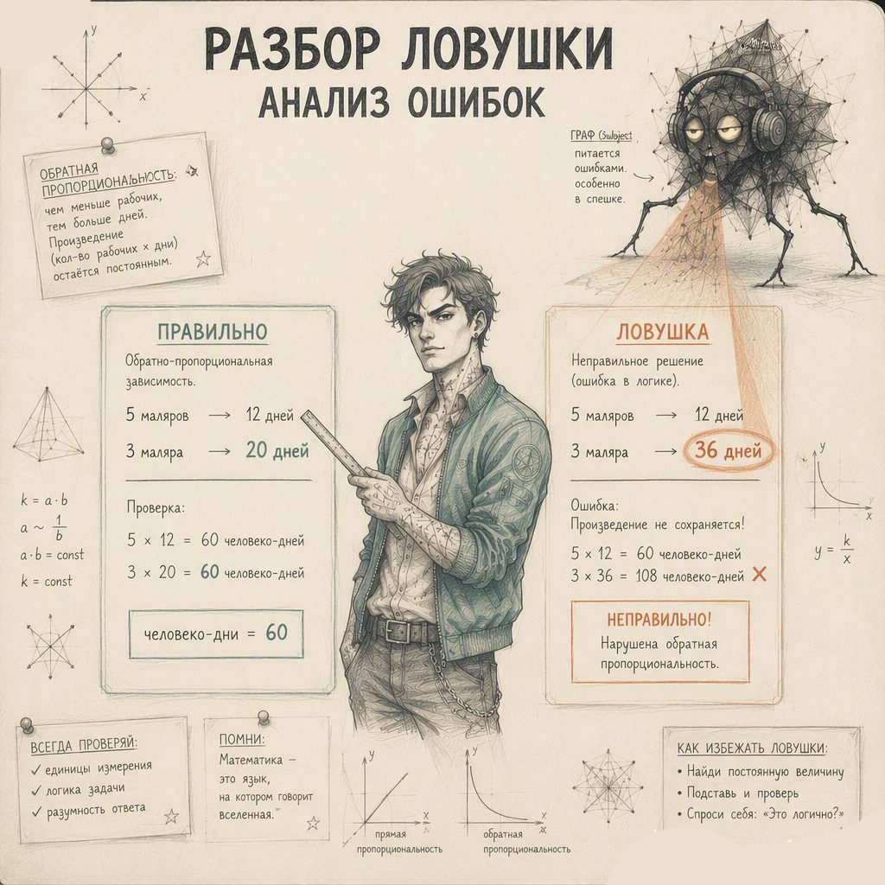

> ️ Возможная ловушка: ученик думает «меньше рабочих → больше дней, значит отвечу что-то большое типа 20». Но если бы ошибся типом зависимости и считал прямую, получил бы \(5/3 \cdot 12 = 20\) — формально правильно число, но по ошибке. Всегда проверяй тип зависимости по смыслу задачи.

**Проверка здравым смыслом:** 3 маляра медленнее, чем 5, поэтому 20 дней > 12 дней ✓. Если бы ответ был 8 дней — здравый смысл нарушен.

### Слайд 22.5. Задача на процент изменения (от старого)

**Условие.** Цена товара выросла с 400 до 500 руб. На сколько процентов она выросла?

**Что прячется:** когда ты считаешь, на сколько процентов выросла или упала величина, процент изменения вычисляется как разность, делённая на СТАРОЕ значение. Старое — это то, что было ДО изменения; именно оно принимается за \(100\%\). Это типовая экзаменационная ловушка: составители рассчитывают, что ты разделишь на новое значение и получишь неправильный ответ.

**Решение:** изменение = \(500 - 400 = 100\). Процент = \(\frac{100 \cdot 100}{400} = 25\%\).

**Ответ:** \(25\%\).

**Проверка здравым смыслом:** \(25\%\) от 400 = 100, плюс 400 = 500 ✓. Если бы считал от 500, получил бы 20% — это типичная экзаменационная ошибка.

> ️ Возможная ловушка: ученик делит на НОВУЮ цену: \(\frac{100 \cdot 100}{500} = 20\%\) — неверно. Процент изменения ВСЕГДА от старого значения.

### Слайд 22.6. Задача на сложный процент (банковский вклад)

**Условие.** Ты положил в банк 50000 руб под \(8\%\) годовых с ежегодной капитализацией. Сколько денег будет через 3 года?

**Справка.** \(8\%\) годовых — типовая ставка по вкладу в белорусском банке на 3 года (в BYN). Такие условия предлагают, например, программы «Сберегательный» и «Линия роста» в Беларусбанке. *(Условные данные для примера — реальные ставки зависят от банка и срока.)*

**Решение по шагам (без калькулятора):**

Формула сложных процентов (Слайд 14):

\[ S_3 = 50000 \cdot \left(1 + \frac{8}{100}\right)^3 = 50000 \cdot (1{,}08)^3 \]

**Почему именно 1,08?** Каждый год мы оставляем 100% старой суммы и прибавляем 8% новых процентов. Итого получаем \(100\% + 8\% = 108\%\). В десятичной дроби это 1,08. Этот множитель применяется каждый год.

Чтобы не возиться с десятичными дробями, распишем степень как три последовательных умножения. **Одно и то же действие повторяется три раза, только сумма каждый раз новая:**

**Год 1:** \(50000 \cdot 1{,}08 = 500 \cdot 108 = 54000\) руб.

**Год 2:** \(54000 \cdot 1{,}08 = 540 \cdot 108 = 58320\) руб.

**Год 3:** \(58320 \cdot 1{,}08 = 583{,}2 \cdot 108 = 62985{,}6\) руб.

> Закон-триггер: одно и то же умножение на 1,08 повторяется каждый год — сумма каждый раз становится новой базой для следующего умножения. Именно поэтому формула называется «сложный процент» (compound interest).

**Ответ:** \(62\,985{,}60\) руб.

**Проверка здравым смыслом:** итог больше начального (62985,60 > 50000 ✓). Реальная доходность за 3 года: \(\frac{62985,60 - 50000}{50000} = \frac{12985,60}{50000} \approx 26\%\), что больше простого «8% × 3 = 24%» — это правильно, капитализация даёт больше.

> ️ Возможная ловушка: ученик путает простой и сложный процент. Простой: \(50000 + 50000 \cdot 0{,}08 \cdot 3 = 62000\). Сложный (с капитализацией): 62985,60 — больше. Разница существенна на длинных сроках.

### Слайд 22.7. Пропорциональность через прямоугольники (участки)

**Условие.** Участок Иванова — прямоугольник со сторонами 72 м и 96 м. Участок Петрова — тоже прямоугольник, его ширина на 15 м **меньше** ширины участка Иванова. Найди длину участка Петрова, если **форма** обоих участков одинаковая (то есть отношение сторон «ширина к длине» у них равное).

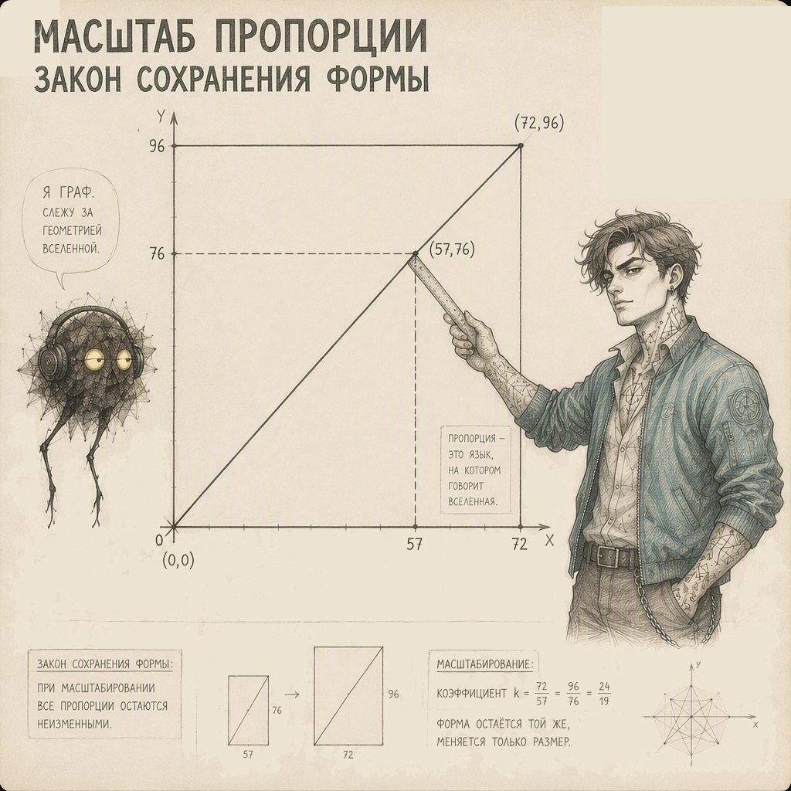

**Что прячется в формулировке:** два прямоугольника имеют одинаковую ФОРМУ — это значит, что отношение сторон у них одно и то же. Это называется **пропорциональностью сторон**.

**Логическая цепочка решения (порядок действий задан формулировкой):**

В условии **порядок** указания сторон один и тот же — сначала ширина, потом длина. Значит, пропорцию составляем именно в этом порядке: \(\frac{\text{ширина}}{\text{длина}}\) у Иванова = \(\frac{\text{ширина}}{\text{длина}}\) у Петрова.

---

**Способ 1. Наглядный (как выглядит сама пропорция).**

Нарисуй два прямоугольника одной формы — большой (Иванова) и поменьше (Петрова). Это значит, что если большой прямоугольник уменьшить в одинаковое число раз по обеим сторонам, получится маленький.

Если у Иванова отношение сторон \(\frac{72}{96}\), то у Петрова оно должно быть **точно таким же**. Зная ширину Петрова (57 м) и отношение \(\frac{72}{96}\), легко найти длину: «если ширина — это 72 „куска", а длина — это 96 таких же „кусков", то один „кусок" = 1 м. У Петрова ширина 57 м, значит, 57 „кусков", и длина тоже 96 „кусков"».

Этот способ показывает, **ПОЧЕМУ пропорция работает**: одинаковая форма = одинаковые пропорции.

---

**Способ 2. Рациональный (через сокращение).**

**Шаг 1. Найди несократимую дробь для отношения сторон Иванова.**

Сокращение — это не «волшебное» действие. Оно работает потому, что у прямоугольника 72×96 форма задаётся отношением сторон, а отношение не меняется при умножении или делении обеих сторон на одно и то же число. Это как уменьшить фотографию в 24 раза пропорционально — она станет 3×4, но форма останется прежней.

Какое число делит и 72, и 96? Это называется **общий делитель**. Проверим 24: \(72 \div 24 = 3\), \(96 \div 24 = 4\). Подходит. Итого: \(\frac{72}{96} = \frac{3}{4}\).

**Почему сокращаем именно сейчас, а не оставляем дробь \(\frac{72}{96}\)?** Потому что в дальнейшем придётся умножать на 57. Сокращённая дробь \(\frac{3}{4}\) даёт меньшие числа — с ней легче считать: \(4 \cdot 57 = 228\) вместо \(96 \cdot 57 = 5472\).

**Шаг 2. Запиши отношение сторон Петрова.**

Ширина Петрова: \(72 - 15 = 57\) м. Длину обозначим как \(x\). Отношение сторон Петрова в том же порядке (ширина, потом длина): \(\frac{57}{x}\).

**Шаг 3. Приравняй формы.**

Формы одинаковые → отношения равны: \(\frac{3}{4} = \frac{57}{x}\).

**Шаг 4. Закон крест-накрест.**

Умножаем числитель одной дроби на знаменатель другой: \(3 \cdot x = 4 \cdot 57\). Отсюда \(x = \frac{4 \cdot 57}{3} = \frac{228}{3} = 76\) м.

**Ответ:** 76 м.

---

**Проверка здравым смыслом:** участок Петрова меньше участка Иванова (57 < 72, поэтому и длина 76 < 96). Если бы длина была больше 96 — нарушение здравого смысла.

**Проверка формы:** у Петрова \(\frac{57}{76}\) тоже сокращается на 19: \(57 \div 19 = 3\), \(76 \div 19 = 4\) — форма та же.

> ⚠️ Возможная ловушка: если ты перепутаешь порядок сторон в условии (сначала длина, потом ширина), то и в пропорции нужно писать \(\frac{\text{длина}}{\text{ширина}}\) — иначе ответ будет неверным. **Всегда проверяй: порядок сторон в условии = порядок сторон в пропорции.** В этой задаче в условии **сначала ширина, потом длина** — значит, и в пропорции сначала ширина, потом длина.

### Слайд 22.8. Переливание жидкости (баланс объёмов)

**Условие.** В двух сосудах содержится 36 л жидкости. Если 10% жидкости из первого сосуда перелить во второй, то в обоих сосудах окажется одинаковое количество жидкости. Сколько литров жидкости было во втором сосуде первоначально?

**Что прячется:** при переливании 10% из первого во второй — количество во втором увеличивается ровно на ту же величину, на которую уменьшается первое. Если после этого они сравнялись, значит, изначально во втором было на 20% меньше, чем в первом.

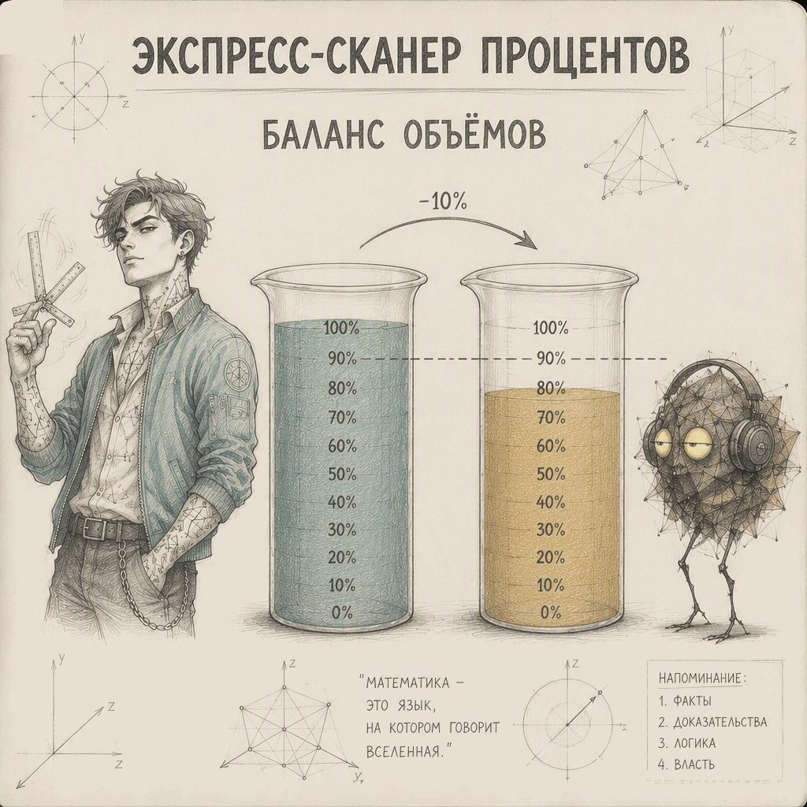

**Решение по шагам:**

1. Пусть в первом сосуде \(x\) л, во втором \((36 - x)\) л.
2. Переливаем 10% из первого во второй. 10% от \(x\) = \(0{,}1x\).
3. После переливания: первый = \(x - 0{,}1x = 0{,}9x\), второй = \((36 - x) + 0{,}1x = 36 - 0{,}9x\).
4. По условию они равны: \(0{,}9x = 36 - 0{,}9x\).
5. \(1{,}8x = 36 \Rightarrow x = 20\) л (было в первом).
6. Во втором: \(36 - 20 = 16\) л.

**Ответ:** 16 л.

**🪞 Визуальная интуиция.** Если ученик умеет рисовать, он может нарисовать два стакана разной высоты (один почти полный, второй — на 20% ниже). После того как 10% перельётся из высокого в низкий, уровни сравняются. Это и есть визуальный смысл уравнения.

**Проверка здравым смыслом:** сумма 20 + 16 = 36 ✓ (всего 36 л по условию). После переливания: первый = 20 − 2 = 18 л, второй = 16 + 2 = 18 л ✓ (равны).

> ️ Возможная ловушка: ученик забывает, что 10% переливается из ПЕРВОГО во ВТОРОЙ, и составляет уравнение «наоборот»: переливает из второго в первый. Получает ответ 20 л (как объём первого), а не 16 л (объём второго). Всегда проверяй направление переливания по условию.

### Слайд 22.9. Квартиры в двух домах (баланс через переменные)

**Условие.** В жилом «Альфе« 13% от общего числа квартир составляют однокомнатные, а в жилом доме «Омега» 61% от общего числа квартир — однокомнатные. 16% всех квартир в двух домах вместе — однокомнатные. Во сколько раз больше общее количество квартир в жилом доме «Альфа», чем в жилом доме «Омега»?

**Что прячется:** в задаче 3 неизвестных (число квартир в «Альфе», в «Омеге«, и число однушек в каждом). Связаны 2 условиями: процент однушек в каждом доме + процент однушек в среднем. Нужно выразить всё через одну переменную.

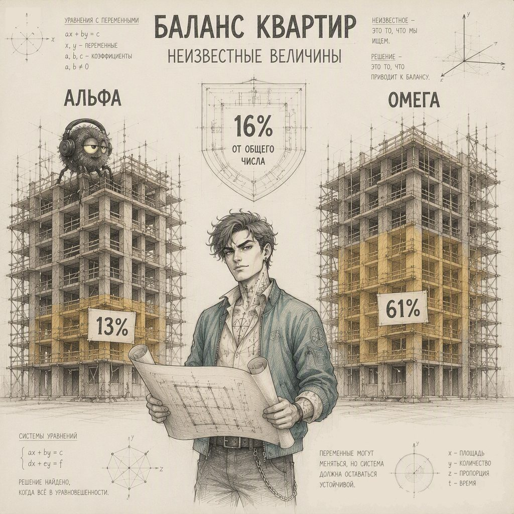

**Решение по шагам (метод переменных):**

1. Пусть в «Альфе» \(A\) квартир, в «Омеге« — \(B\) квартир. Всего: \(A + B\).
2. Однушек в «Альфе»: \(0{,}13A\).
3. Однушек в «Омеге«: \(0{,}61B\).
4. Всего однушек: \(0{,}13A + 0{,}61B\).
5. По условию: \(\frac{0{,}13A + 0{,}61B}{A + B} = 0{,}16\).
6. \(0{,}13A + 0{,}61B = 0{,}16A + 0{,}16B\).
7. \(0{,}45B = 0{,}03A\).
8. \(\frac{A}{B} = \frac{0{,}45}{0{,}03} = 15\).

**Ответ:** в «Альфе» в 15 раз больше квартир, чем в «Омеге«.

**🪞 Интуиция через «средневзвешенное значение».** 16% — это средневзвешенное двух процентов (13% и 61%). Так как 16% ближе к 13%, то «Альфа» (с меньшим процентом однушек) должен занимать большую долю в общем количестве. А значит, в «Альфе» квартир значительно больше.

**Проверка здравым смыслом:** 16% ближе к 13%, чем к 61%. Это значит, что «Альфа» (с 13%) должен занимать бо́льшую долю в общем количестве квартир, и его доля в однушках должна «перетягивать» средневзвешенное к 13%. Ответ «в 15 раз больше» — это сильное перетягивание, что логично для разрыва между 13% и 61%.

> ️ Возможная ловушка: ученик переворачивает ответ и пишет «в 15 раз меньше». Также частая ошибка: делить \(B\) на \(A\) вместо \(A\) на \(B\). Всегда проверяй, что ищем: «во сколько раз «Альфа» больше «Омеги»» означает \(\frac{A}{B}\), а не \(\frac{B}{A}\).

### Слайд 22.10. Финальная самопроверка

Реши 5 задач после прохождения всего урока. Это покажет, насколько ты готов к ЦТ по теме «Проценты, пропорции, масштаб». Задачи взяты из банка математики с тестирований РИКЗ.

**Задача 1 (ловушка на сложные проценты).** Цена товара сначала выросла на 25%, а потом снизилась на 20% от НОВОЙ цены. Как изменилась итоговая цена относительно начальной (в процентах)?

**Задача 2 (среднее арифметическое через пропорцию).** Среднее арифметическое пяти чисел равно 12. К этим числам прибавили ещё одно число, и среднее стало 14. Чему равно это новое число?

**Задача 3 (масштаб и единицы).** На карте с масштабом \(1 : 100\,000\) прямоугольный участок имеет размеры \(4\) см \(\times\) \(6\) см. Какую площадь (в гектарах) имеет этот участок в реальности?

**Задача 4 (процент от процента в банке).** Банк начисляет \(10\%\) годовых. Какую сумму получит вкладчик через 2 года, если положил 50 000 руб и проценты начисляются по схеме сложного процента?

**Задача 5 (обратная зависимость в задаче на время).** Бассейн наполняется первой трубой за 6 часов, второй — за 4 часа. За сколько часов наполнится бассейн, если открыть обе трубы одновременно?

**Как интерпретировать результат после урока:**

- **5 из 5** — тебе можно переходить сразу к ловушкам Блока 8 и шпаргалкам. Теория в голове.
- **3–4 из 5** — повтори Слайды 16–21 (шпаргалки) и попробуй ловушки из Блока 8.
- **0–2 из 5** — пройди весь урок ещё раз от Слайда 1, потом повтори эту самопроверку.
- **3–4 из 5** — пройди весь урок по порядку, акцент на ловушки.
- **0–2 из 5** — начни с Слайда 1, проходи всё подряд, ловушки оставь напоследок.

Не важно, сколько ты решил — урок построен так, чтобы ты понял всё. Если что-то непонятно — вернись и прочитай ещё раз.

### Слайд 22.11. Карта твоего пути: что ты прошёл

Урок состоит из восьми блоков теории. Каждый блок решает свою задачу, и каждый следующий блок опирается на инструменты предыдущего.

**Блок 1. Пропорция.** Главный инструмент урока — закон крест-накрест. Ты научишься видеть равенство двух дробей и находить неизвестное.

**Блок 2. Зависимости.** Прямая «больше → больше» и обратная «больше → меньше» — два главных сценария задач.

**Блок 3. Масштаб.** Отношение 1:X между чертёжом и реальностью, перевод км ↔ м ↔ мм через шесть нулей.

**Блок 4. Проценты.** Определение процента, три формулы (часть от целого, целое по части, процент по части), распознавание целого и части в условии.

**Блок 5. Типы задач.** Скидки, налоги, простой процент, изменение цены, смеси и сплавы — на каждый тип своя формула.

**Блок 6. Сложные проценты.** Когда процент применяется несколько раз подряд: банковский вклад с капитализацией, инфляция, ежегодный рост.

**Блок 7. Сборник формул.** Шесть шпаргалок: пропорция, зависимости, проценты, масштаб, сложный процент — распечатай и держи под рукой.

**Блок 8. Возможные ловушки.** Десять задач на реальных экзаменационных формулировках. Если ты решил их без ошибок — ты готов к ЦТ.

**Логика движения:** пропорция → зависимости → масштаб → проценты → сложные проценты → ловушки. Каждый следующий блок строится на инструментах предыдущего, ничего не изучается изолированно.

**Между блоками — мостики.** Это короткие паузы: «Ты прошёл блок N, теперь передохнёшь и пойдёшь в блок N+1». В каждом мостике есть паспорт темы (что ты только что освоил) и анонс следующего блока.

### Слайд 0.5. Глоссарий: термины из задачников РИКЗ

В этом уроке используются термины, которые встречаются в реальных заданиях ЦТ и РИКЗ. Если ты встречаешь незнакомое слово — открой этот глоссарий.

| Термин | Что значит | Где встречается | Пример из задачи |
|---|---|---|---|
| **Пропорция** | равенство двух дробей | весь урок | \(\frac{a}{b} = \frac{c}{d}\) |
| **Крайние члены** пропорции | числа \(a\) и \(d\) (по краям дроби) | Блок 1 | в \(\frac{2}{3} = \frac{4}{6}\) крайние — 2 и 6 |
| **Средние члены** пропорции | числа \(b\) и \(c\) (внутри дроби) | Блок 1 | в \(\frac{2}{3} = \frac{4}{6}\) средние — 3 и 4 |
| **Крест-накрест** (закон) | произведение по диагонали равно | Блок 1, Блок 8 | \(a \cdot d = b \cdot c\) |
| **Прямая зависимость** | две величины растут/падают синхронно | Блок 2 | больше товара → больше денег |
| **Обратная зависимость** | одна растёт, другая падает | Блок 2, Блок 8 | больше рабочих → меньше дней |
| **Масштаб** | отношение размера на бумаге к реальному | Блок 3 | \(1 : 100\) (1 см = 100 см) |
| **Метрический мост** | перевод км ↔ м ↔ мм через 6 нулей | Блок 3 | \(1\) км = \(1\,000\) м = \(1\,000\,000\) мм |
| **Процент** | сотая часть числа (\(p\% = \frac{p}{100}\)) | Блок 4 | \(15\%\) = \(\frac{15}{100}\) = 0,15 |
| **Целое** | то, что принимается за 100% | Блок 4, Блок 5 | в задаче «15% от 200» целое = 200 |
| **Часть** | то, что мы ищем (или дано как \(p\%\) от целого) | Блок 4, Блок 5 | в задаче «15% от 200» часть = 30 |
| **Скидка** | снижение цены на \(p\%\) | Блок 5 | скидка 15% на товар за 200 руб |
| **Простой процент** | процент применяется один раз к исходной сумме | Блок 5 | подоходный налог каждый месяц от зарплаты |
| **Сложный процент (капитализация)** | процент применяется к НОВОЙ сумме каждый период | Блок 6, Блок 8 | банковский вклад с ежегодной капитализацией |
| **Капитализация** | то же, что сложный процент (проценты прибавляются к сумме) | Блок 6 | «вклад с капитализацией» = «сложный процент» |
| **Множитель роста** \(k\) | на него умножается сумма каждый период: \(k = 1 + \frac{p}{100}\) | Блок 6 | при 10% годовых \(k = 1{,}1\) |
| **Средневзвешенное значение** | среднее с разными весами | Блок 8 | среднее 13% и 61% с весами = 16% |
| **Прямоугольная пропорциональность** | отношение сторон сохраняется | Блок 8 | участки Иванова и Петрова |
| **Баланс объёмов** | при переливании сумма объёмов постоянна | Блок 8 | 20 л + 16 л = 36 л |
| **Перевёрнутая пропорция** | обратная зависимость, когда прямая даёт неверный ответ | Блок 2, Блок 5 | 3 рабочих за 12 дней ≠ 3/12 = 9/x |

**Слова-подсказки в условии задачи (как распознать тип задачи):**

| Слово в условии | Что это значит | Какую формулу применять |
|---|---|---|
| «на сколько процентов выросла/упала» | процент изменения | \(\frac{(B - A)}{A} \cdot 100\) |
| «от какого числа» | ищем целое | \(A = \frac{B \cdot 100}{p}\) |
| «составляет X%» | ищем часть | \(\text{Часть} = A \cdot \frac{p}{100}\) |
| «от» (после числа) | целое стоит после | \(A\) = целое |
| «каждый год/месяц с капитализацией» | сложный процент | \(S_n = A \cdot (1 + \frac{p}{100})^n\) |
| «рабочие/трубы одинаковой производительности» | обратная зависимость | произведение в строчку |
| «масштаб 1:X» | X — реальных единиц на 1 бумажную | \(\frac{\text{бумага}}{\text{реальность}} = \frac{1}{X}\) |

### Слайд 22.12. Финал

